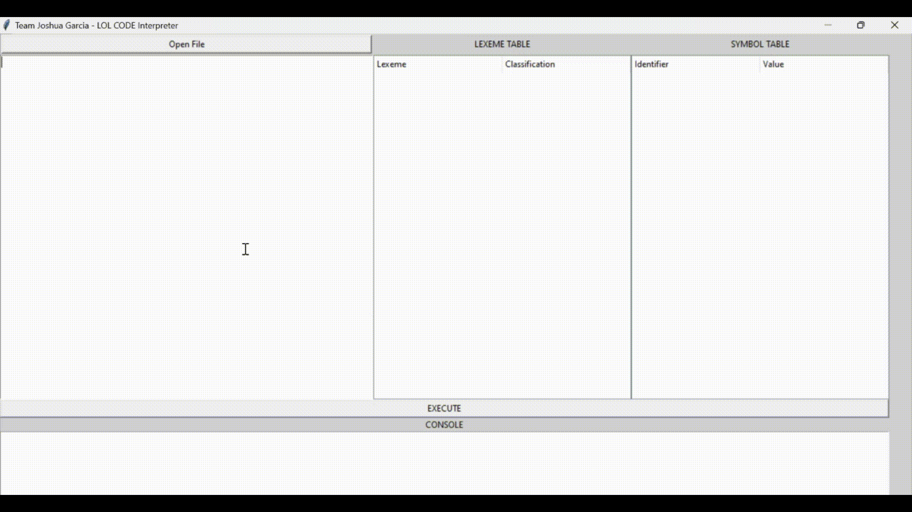

# Project: LOLCode Interpreter
### TEAM JOSHUA GARCIA (T-1L)
- #### Zenith Averi V. Cipriano
- #### Sebastian M. Villavicencio

## Description
> You are to create an interpreter for the LOLCode Programming Language. The constructs required for the project are discussed [here](https://drive.google.com/file/d/1ooCMhXHBoz_SRve0uTH5VF4Y94habUld/view). The interpreter must be able to analyze each line of the program lexically, syntactically, and semantically.

## Instructions
```
You are required to submit the following for the project:
    1. A .zip file (filename: <GroupName>_<section>.zip) which should contain the following:
        a. a text file (filename: contributors.txt) that contains the name of all contributing groupmates;
        b. a folder (filename: source code) that contains all the necessary files needed to run your project; and
        c. a Readme.md file that contains the instructions on how to run your project. This includes the 
        necessary dependencies, along with the instructions on how to install them.
    2. Submit your peer evaluation.
```

## Required Dependencies
- python
- tkinter 
- re


## User Guide
### Display GUI
> If you have Python installed on your system, you can open `gui.py` by right-clicking it. (Right-click -> Open with -> Python)


<br />

> Using the command prompt, enter `python gui.py`. This would also display the GUI if you're in the right directory.


<br />

### How to Use the File explorer
> At the top left corner of your screen below the text `Team Joshua Garcia - LOL CODE Interpreter`, you'll find the `Open File` button. This button will allow you to choose a file to load in your text editor.


<br />

### How to Use the Text editor
> The Text editor is right below the File explorer button `Open File`.

<br />

> You can directly write your lolcode on the text editor.

<br />

> You can paste it using `Ctrl+V`.

<br />

> Or edit the text of a chosen file.

<br />

### How to Use the Lexeme Table (List of Tokens)
> The Lexeme table is the table on the 2nd column (the middle column) with the label `LEXEME TABLE` at the top.

<br />

> It holds all the tokens present in your lolcode along with their labels/functions. For example, `\n` is a line delimiter. You can use this to retrace your steps.

<br />

### How to Use the Symbol Table
> The Symbol table holds all the declared and the implicit variables and their respective values at a given time. This is found on the rightmost column with the label `SYMBOL TABLE`.

<br />

> You can use this to check if the results are what you expected given your algorithm. For example, the `SUM OF num AN 13` is `30` saved at `sum`.

<br />

### How to Use the Execute Button
> hi

Thank you! :smile_cat:
